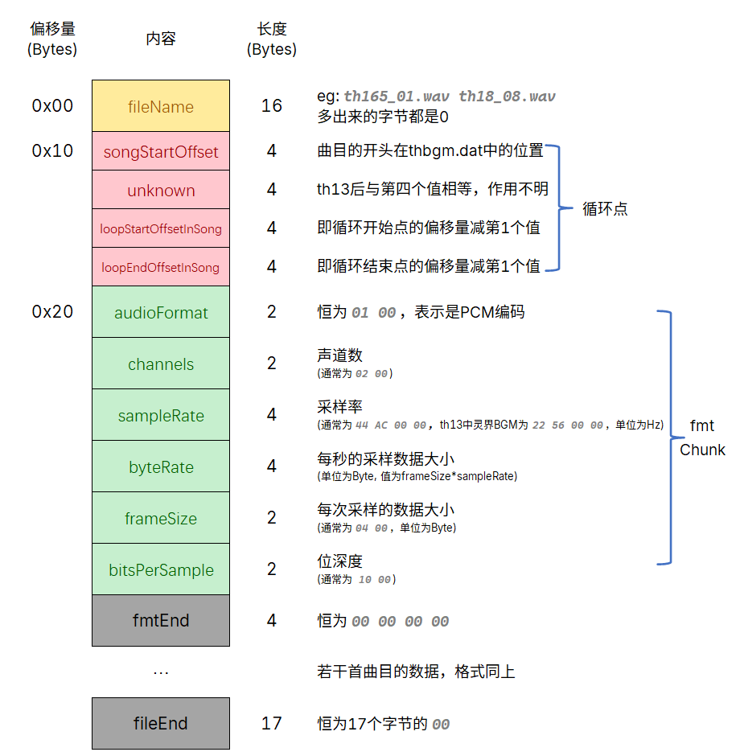
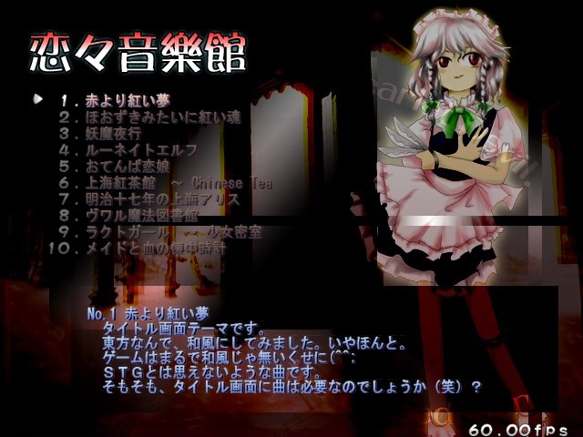
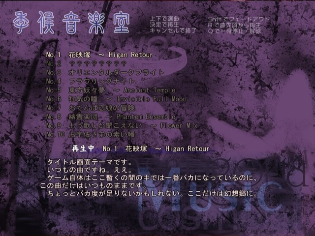
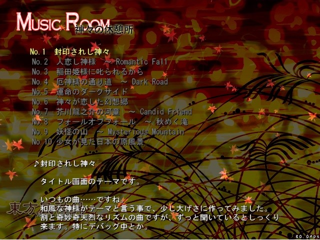
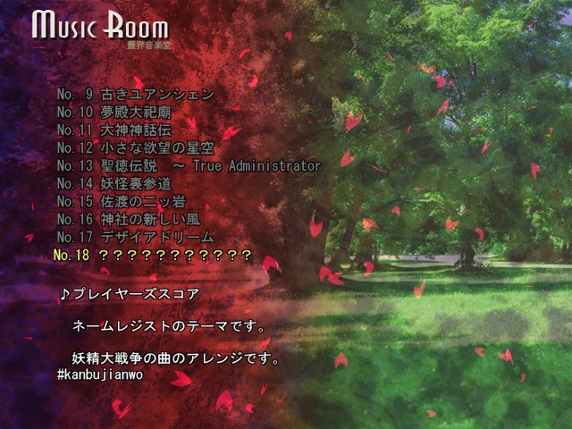

封面Pixiv插画ID：94070537，画师：Akyuun。如有侵权请联系我以删除之。

***

（本文主要讨论的是弹幕作。格斗作不讨论。）

众所周知，原作的游戏大小多在400~500MB（除了体验版）。而游戏文件里最大的都是一个名为`thbgm.dat`（体验版游戏中为`thbgm_tr.dat`）的文件（th07+）或一个名为`bgm`的文件夹（th06）。显然这就是游戏BGM所在了。~~果然游戏只是音乐的载体而已。~~ 游戏BGM为什么这么大？它是如何储存的？本文将讨论原作BGM的相关文件格式。

<details>

<summary>目录</summary>

- [为什么BGM这么大——BGM音频部分的文件格式](#为什么bgm这么大bgm音频部分的文件格式)

- [还有一些信息去哪了——循环点与wav文件头的储存](#还有一些信息去哪了循环点与wav文件头的储存)

    - [红魔乡](#红魔乡)

    - [妖妖梦及妖妖梦以后](#妖妖梦及妖妖梦以后)

- [名与实的联系——Music Room 中的曲名和文字](#名与实的联系music-room-中的曲名和文字)

    - [红妖永](#红妖永)

    - [花映冢](#花映冢中的小改动)

    - [文花帖](#文花帖中的小改动)

    - [妖精大战争与神灵庙](#妖精大战争与神灵庙中的小改动)

</details>

## 为什么 BGM 这么大——BGM 的音频数据

不难发现东方红魔乡 ~~（搶曽峠杺嫿）~~ 的`bgm`文件夹里都是以`th06_xx`的格式命名的wav文件。嗯......这么pristine（原始）的不压缩的音频格式能不大吗......

而从东方妖妖梦起，`bgm`文件夹为`thbgm.dat`文件所取代。文件格式变了吗？东方妖妖梦~东方花映冢的游戏里仍然把音频版的BGM音源叫做“WAV”，但`thbgm.dat`改个后缀名直接扔进音频播放器会发现打不开。

由[这篇文章](https://www.cnblogs.com/blumia/p/4282114.html)可知，把`thbgm.dat`当成原始音频数据扔进GoldWave、Audition等软件里，便可以播放了。所以这个文件应该仍然包含wav格式的音频数据部分。

以星莲船的`thbgm.dat`为例，扔进HxD Hex Editor里，可以看到这样的内容：

```
5a 57 41 56 01 00 00 00 00 12 00 00 00 00 00 00
...
```

通过观察可以推测，文件的结构如下图所示。


本质上确实还是wav格式。

那么这就是“为什么BGM这么大”和“BGM如何储存”的全部答案。

全文终......ん？

你说游戏怎么从连续的音频数据里找到每一首曲子的位置？

曲子在游戏里不是循环播放的吗，游戏怎么知道这首曲子从哪到哪是循环部分？

原来的wav格式的文件头里还有那么多正常播放需要的信息（比如采样率、声道数、位深度），怎么在`thbgm.dat`里没有？

难道这些是硬编码在游戏代码里了吗？

嗯......这些可能会改变的东西理论上不应该硬编码，尤其是循环点，肯定是每次都要改的。如果不在`thbgm.dat`里，那么这一些应该放在了另外的二进制文件或者文本文件里。这样便于修改，还可以写个脚本一键生成，减少修改时的重复性工作。酒鬼正是设计了另外的文件来存放这些内容。

## 好像少了东西——循环点与wav文件头

### 红魔乡

BGM仍然使用最原始的wav格式的红魔乡不存在文件头的问题，只需要解决循环点的问题。

用[thtk](https://github.com/thpatch/thtk)中的thdat解包游戏目录下的`紅魔郷MD.DAT`，得到的除了midi格式的BGM以外，发现还有一些和BGM同名的`th06_xx.pos`文件和一个`musiccmt.txt`。后者留到后面再做讨论，前者应该就是我们要找的循环点了。

以`th06_01.pos`为例，同样用HxD打开：

```
a7 09 04 00 a5 d8 27 00
```

可以猜测，前一半是循坏开始点，后一半是循环结束点（顺便一提，数值的采用的字节顺序是小端序 [^1] ）。[Touhou Wiki上的有关信息](https://en.touhouwiki.net/wiki/Technical_Information/BGM
)表明确实是这样：

> loops in 紅魔郷MD.dat/*.pos  
> Format: **\<start sample\>**.4b **\<end sample\>**.4b

~~（你thb上的脚本对照表里怎么没有这个x）~~ （20230721：我已经commit上去了）

这个"sample"是指什么？由[这个帖子](https://tieba.baidu.com/p/4817367665/)可以归纳出其数值的计算公式：

> 设曲目播放到第t秒时开始/结束循环.  
> 则循坏开始点/结束点的sample = `44100 * t`（结果取整数）  

显然44100即红魔乡所有曲目的采样率44.1kHz。

那么结合大学《计算机基础》（或者高中的《信息技术》）中音频数字化的相关内容 [^2] ，我们可以知道sample的取值n即表示“文件中的第 (n+1) 个采样点”。

所以我们现在知道了，红魔乡的BGM循环点用采样点表示，储存在`紅魔郷MD.DAT`里的`th06_xx.pos`中。

### 妖妖梦及妖妖梦以后

~~这一部分就是这篇文章前两版的内容，自己看去。~~

妖妖梦起，游戏目录下的`thxx.dat`（xx为游戏编号，体验版游戏为`thxx_tr.dat`）用[thtk](https://github.com/thpatch/thtk)解包后会得到一个`thbgm.fmt`文件（体验版游戏可能是`thbgm_tr.fmt`）。

"fmt"，不难想到wav文件头里的FormatChunk [^3] 。而我们刚才所说的wav文件“正常播放需要的信息”，其实就是wav文件头里的FormatChunk的数据部分。

以th19的`thbgm_tr.fmt`为例，这个也用HxD打开看看：

```
74 68 31 39 5f 30 31 2e 77 61 76 00 00 00 00 00  
10 00 00 00 c0 43 94 01 00 20 03 00 c0 43 94 01  
01 00 02 00 44 ac 00 00 10 b1 02 00 04 00 10 00  
00 00 00 00 ...  
00 00 00 00 00 00 00 00 00 00 00 00 00 00 00 00  
00
```

发现第三行确实就是完完整整的FormatChunk的数据部分，一点不差：  
```
01 00 02 00 44 ac 00 00 10 b1 02 00 04 00 10 00
```

那其他内容呢？在HxD里可以看见，第一行对应的字符便是我们在红魔乡里见过的文件名格式：`th19_01.wav`

第二行则是循环点相关。具体见下面整个文件的结构。

<!--  -->

在[THBWiki上的脚本对照表](https://thwiki.cc/-/19gc/#FMT%E6%96%87%E4%BB%B6)用了一个C语言的结构体来表示整个文件的结构，我觉得挺清晰的。  
~~唯一不清晰的点是没有对语言做任何标注，对C或类似编程语言不了解的人真看不出你在写什么。~~  
改了一下copy过来：

```C
typedef struct //单首曲目
{
    char fileName[16];                    //文件名。（大端序，下面的数值皆为小端序）
    unsigned int songStartOffset;         //曲目开头在thbgm.dat中的偏移量。单位是bytes，下面三项同。
    unsigned int unknown;                 //th13起与loopEndOffsetInSong恒等，此前取值意义不明。
    unsigned int introLength;             //循环开始时相对于songStartOffset的偏移量，或理解为曲子的前奏的长度。
    unsigned int totalLength;             //循环结束时相对于songStartOffset的偏移量，或理解为曲子的总长。

    /*fmt chunk*/
    unsigned short formatTag;             //恒为1，音频数据为PCM编码
    unsigned short channels;              //声道数，常为2
    unsigned int samplePerSec;            //采样率，常为44100，神灵庙的灵界版BGM是22050
    unsigned int bytesPerSec;             //blockAlign*samplePerSec 即每秒的采样数据的大小，单位是bytes
    unsigned short blockAlign;            //bitsPerSample*channels/8 即每次采样的大小，常为4（单位是bytes）
    unsigned short bitsPerSample;         //位深度，常为16（单位是bit）
    int fmtEnd;                           //结尾4个字节都是0
} thfmt_t;

typedef struct  //整个文件
{
    thfmt_t fmtList[18];  //18只是举个例子，看实际曲目数
    char fileEnd[17];     //结尾17个字节都是'\0'
} thfmt_body_t;
```
[Touhou Wiki上的说明](https://en.touhouwiki.net/wiki/Technical_Information/BGM)也贴上来，这个比较简洁：
> Format: {\<wav name\>.16b **\<start offset\>**.4b \<???\>.4b **\<intro length\>**.4b **\<total length\>**.4b  
> \<[RIFF WAVEfmt header (WAVEFORMATEX structure)](https://learn.microsoft.com/en-us/previous-versions/dd757713(v=vs.85))\>.18b 0000 }.52b*

设前奏或全曲时长为t秒，则对应 **\<intro length\>** 或 **\<total length\>** 的计算公式：

    length = bytesPerSec * t
           = blockAlign * samplePerSec * t
           = (samplePerSec * t) * bitsPerSample * channels / 8

至于 **\<start offset\>** ，所谓的偏移量其实就是前面全部内容的length嘛。

因此，手动获取的话，可以采取[前面提到的](#为什么bgm这么大bgm音频部分的文件格式)把`thbgm.dat`当成原始音频数据扔进音频编辑软件里的做法。  
在软件中查看曲目开始的时间点的时间t，即为前面所有内容的时长t。  
但是注意代入公式的参数应与你打开文件时的设置一致，而不是`thbgm.fmt`里的参数。  
软件会把`thbgm.dat`的文件头也当做音频数据，所以算出来的结果已经包含了文件头的长度。

但是，感觉不如写个脚本，生成`thbgm.dat`的同时生成配套的`thbgm.fmt`。（

## 名与实的联系——Music Room 中的文字

现在来看看刚才提到的`musiccmt.txt`。在`thxx.dat`解包后的文件里也发现了这个。

试着用记事本打开红魔乡的`musiccmt.txt`。打开后可以看到......

```
侽侾俀俁係俆俇俈俉俋侽侾俀俁係俆侽侾俀俁係俆俇俈俉俋侽侾俀俁係俆  
...
```

？

嗯......Windows自带的记事本不管怎么翻新都是这么垃圾，在中文环境下打开Shift-JIS编码的文件会乱码。

换个编辑器打开就好了。

打开之后，可以发现主要是出现在Music Room里的文字，还有曲目对应的文件名。

```
０１２３４５６７８９０１２３４５０１２３４５６７８９０１２３４５  
@bgm/th06_01.mid  
赤より紅い夢  
No.1 赤より紅い夢  
　タイトル画面テーマです。  
　東方なんで、和風にしてみました。いやほんと。  
　ゲームはまるで和風じゃ無いくせに(^^;  
　ＳＴＧとは思えないような曲です。  
　そもそも、タイトル画面に曲は必要なのでしょうか（笑）？  
 
...
```

推测应该是Music Room的曲目列表。

### 红妖永

对照着Music Room来看，在红魔乡中（也适用于妖和永）：

- 那一行全角数字不知道有什么用。

- 格式大体上是：

```
@bgm/<文件名>.mid
<Music Room列表里显示的标题>
<乐评里的标题>
　<乐评正文>

...
```

文件名虽然写上了后缀`.mid`，但使用WAV音源时游戏应该会匹配同名的`.wav`文件。  
尝试将`mid`改成任意的3个字母，仍然能播放；但是改成非3个字母，在红魔乡里就不能正常播放，而在妖妖梦和永夜抄里可以正常播放。如果尝试删掉后缀名，红妖永都会发生崩溃。

另外，上面的无法正常播放的情况，仅限于在Music Room里无法播放。可以推测游戏进程中，以及标题画面中，BGM的读取并不受这个文件影响。

乐评正文的缩进是每行前敲一个全角空格实现的。

另外，在永夜抄里添加了"Now Playing"的提示。内容和 **\<乐评里的标题\>** 是一样的。



### 花映冢中的小改动
```
０１２３４５６７８９０１２３４５０１２３４５６７８９０１２３４５  
@bgm/th09_00.mid  
No.1  花映塚　～ Higan Retour  
　　タイトル画面テーマです。  
　　いつもの曲ですね。ええ。  
　　ゲーム自体はここ暫くの間の中では一番バカになっているのに、  
　この曲だけはいつものままです。  
　　ちょっとバカ度が足りないかもしれない。ここだけは幻想郷に。  

...
```

可以发现相比红妖永少了一行 **\<Music Room列表里显示的标题\>**。因为Music Room里的样式改了。原来的 **\<乐评里的标题\>** 不再显示在乐评中，只显示上方在“再生中”的文字旁，列表里的标题直接使用了“再生中”旁的文字。

缩进变为了每一句的开头用两个全角空格，句中换行用一个全角空格。

没有midi的曲目的后缀名仍然是`.mid`。后缀名相关特性同妖永。



*（题外话：为什么花映冢Music Room里新加的暂停和淡出到后面又没了）*

### 文花帖中的小改动

```
#  
# 曲のコメント  
#  
#0１２３４５６７８９０１２３４５６７８９０１２３４５６７８９０  
@bgm/th10_02.wav  
No.1  封印されし神々  
♪封印されし神々  
　  
　タイトル画面のテーマです。  
　  
　いつもの曲……ですね。  
　和風な神様がテーマと言う事で、少し大げさに作ってみました。  
　割と奇妙奇天烈なリズムの曲ですが、ずっと聞いているとしっくり  
　来ます。特にデバッグ中とか。  

...
```

（20230724：下列变化最早出现在东方文花帖而非风神录，故修改小标题，内容不变。）

前面添加了三行。
```
#  
# 曲のコメント  
#
```

"\#"是注释吗？似乎不是。全角数字那一行的内容变了，前面也加了个"\#"。  
（数字里第1个0就是半角的，并不是我复制时候出错了。而且一直到兽王园这个半角的0都没改过来......）

随着MIDI音源的彻底移除，文件名的后缀改成了`.wav`。但后缀名相关特性仍同妖永花。

其余部分又回到了之前的三行的格式。但是原本的 **\<乐评里的标题\>** 的格式继续用在列表中，现在的乐评中的标题前面加了个"♪"（于是在游戏里和正文对齐了）。

另外乐评中的空行上其实都有一个全角空格。没有全角空格的行读取时会被忽略。



### 妖精大战争与神灵庙中的小改动
```
#  
# 曲のコメント  
#  

#0１２３４５６７８９０１２３４５６７８９０１２３４５６７８９０  
@bgm/th13_00  
No. 1 欲深き霊魂  
♪欲深き霊魂  
　  
　タイトル画面のテーマです。  
　  
　いつものメロディです。今回はダーク色多めでお送りします。  
　ＳＴＧはポップな世界観よりダークな方が好まれる傾向にある  
　気がします。  
　このゲームは全く持ってダークじゃないんですけどね。  

...
```

（20230724：下列变化有部分最早出现在妖精大战争，故修改小标题和对应内容。）

妖精大战争中，列表中的标题的"No."与数字之间加了一个半角空格。

神灵庙中，文件名的后缀去掉了。尝试加上后缀名无法正常播放，但不会崩溃，而是会播放标题曲。

此外，尝试将疮痍曲加进来时，可以播放，但总是会显示为没有在游戏进程中播放过的曲目，如下图所示。  
暂时不知道游戏是怎么记录有没有播放过的。最后一行是我刚才说“\#似乎不是注释”的原因。



<!--下面是脚注-->

[^1]: 将一个多位数的低位放在较小的地址处，高位放在较大的地址处，则称小端序。  
例如在这一处，值`0x000409a7`被记为了`a7 09 04 00`。  
后文提到的大端序则会反过来记为`00 04 09 a7`，和我们从左往右的阅读顺序一致。

[^2]: 在音频数字化的三个步骤“采样——量化——编码”中，“采样”时每秒采样的次数称为采样率。故`采样率 * 秒数`即表示使用这一采样率时，时长为这一秒数的音频包含的采样点个数。

[^3]: 该chunk开头三个字节便是字符"fmt"。